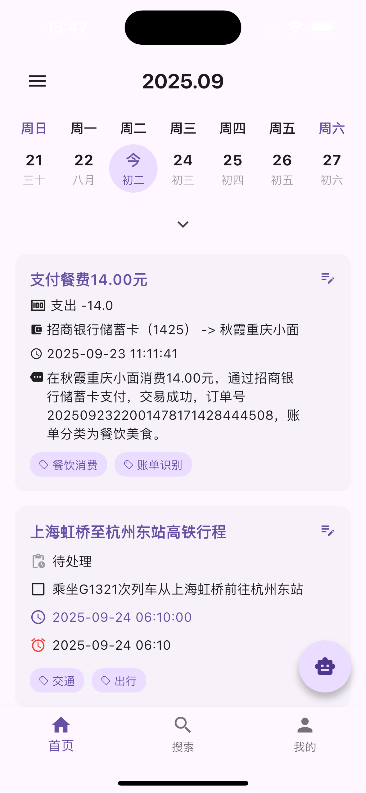
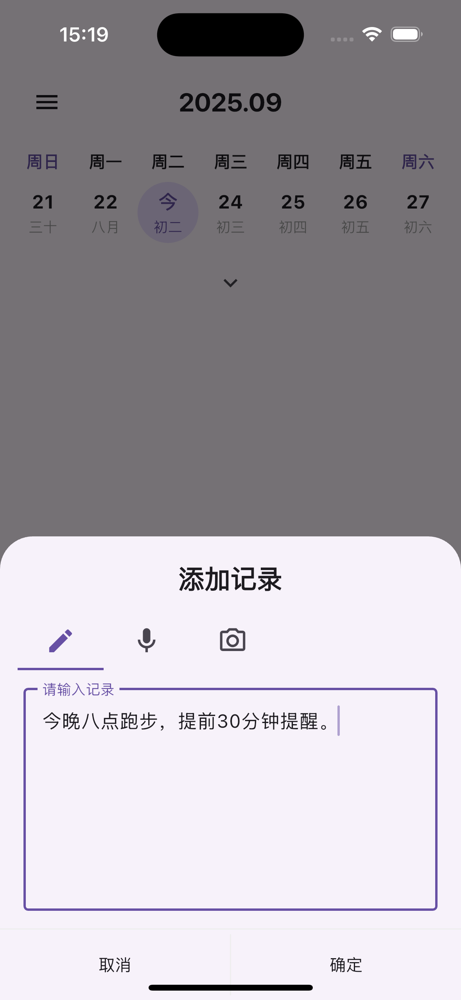
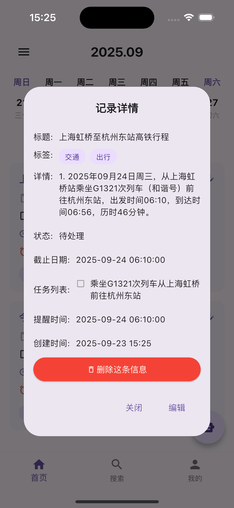

# Float Note

一个Flutter 笔记应用，支持语音记录、搜索和本地通知提醒功能。

## 功能特点

- 📝 **笔记管理**：创建、编辑和管理个人笔记
- 🎙️ **语音记录**：支持录制和播放语音笔记
- 🔍 **搜索功能**：快速查找笔记内容
- 🔔 **本地通知**：设置提醒和通知
- 🌓 **主题切换**：支持明暗主题
- 🌐 **国际化**：支持中英文切换
- 🔐 **用户认证**：安全的用户登录系统

## 应用预览

以下是应用的截图预览：





## 技术栈

- **框架**: Flutter
- **语言**: Dart
- **状态管理**: Riverpod
- **导航**: GoRouter
- **UI 组件**: Flutter Material/Cupertino
- **网络请求**: Dio
- **权限管理**: Permission Handler
- **音频处理**: Just Audio
- **数据存储**: Shared Preferences
- **通知**: Flutter Local Notifications

## 项目结构

```
lib/
├── app/
│   └── app.dart          # 应用入口组件
├── config/
│   └── configure.dart    # 配置文件
├── constants/            # 常量定义
├── data/
│   ├── mapper/
│   ├── models/
│   ├── repositories/
│   └── services/
├── domain/
│   ├── core/
│   └── models/
├── ui/
│   ├── core/
│   ├── home/
│   ├── login/
│   ├── profile/
│   ├── record/
│   └── search/
├── utils/                # 工具类
├── main.dart             # 程序入口
├── main_development.dart # 开发环境入口
└── main_staging.dart     # 测试环境入口
```

## 安装和运行

### 前置条件

- 已安装 [Flutter SDK](https://flutter.dev/docs/get-started/install)
- 已安装 [Dart SDK](https://dart.dev/get-dart)
- 配置好开发环境（Android Studio/Xcode）

### 步骤

1. 克隆仓库

```bash
git clone https://github.com/yourusername/float_note.git
cd float_note
```

2. 安装依赖

```bash
flutter pub get
```

3. 运行应用

```bash
# 开发环境
flutter run -t lib/main_development.dart

# 测试环境
flutter run -t lib/main_staging.dart

# 生产环境
flutter run -t lib/main.dart
```

## 构建应用

```bash
# Android 构建
flutter build apk

# iOS 构建
flutter build ios

# Web 构建
flutter build web
```

## 主要模块说明

### 1. 通知服务

应用提供了强大的本地通知功能，支持设置提醒、更新应用角标等。通知服务通过 `NotificationService` 类实现，支持前台和后台通知处理。

### 2. 语音记录

通过 `Just Audio` 插件实现语音录制和播放功能，用户可以轻松创建和管理语音笔记。

### 3. 搜索功能

实现了高效的笔记搜索功能，帮助用户快速定位需要的内容。

### 4. 用户认证

提供安全的用户登录系统，保护用户数据安全。

## 权限说明

应用需要以下权限：

- 通知权限：用于显示提醒和通知
- 音频录制权限：用于语音记录功能
- 存储权限：用于保存笔记和音频文件

## 国际化支持

应用支持以下语言：
- 中文（简体）
- 英文

用户可以在设置中切换语言偏好。

## 注意事项

- iOS 平台上，角标更新需要特定的权限配置
- 确保在 `Info.plist` 中正确配置了通知和音频相关权限
- Android 13+ 设备需要特别注意通知权限的请求方式

## 开发说明

### 代码规范

- 遵循 Dart 官方代码风格
- 使用 Riverpod 进行状态管理
- 采用 Provider 模式组织代码结构
- 支持空安全

### 开发工具

- Android Studio / VS Code
- Flutter DevTools
- Dart Analysis Server

## 联系方式

如有问题或建议，请联系项目维护者：

- 邮箱：zhatengfei@gmail.com
- GitHub：[https://github.com/shengteng9/float_note](https://github.com/shengteng9/float_note)

## License

本项目采用 MIT 许可证 - 详见 [LICENSE](LICENSE) 文件

---

*Float Note - 让记录变得简单而高效*


